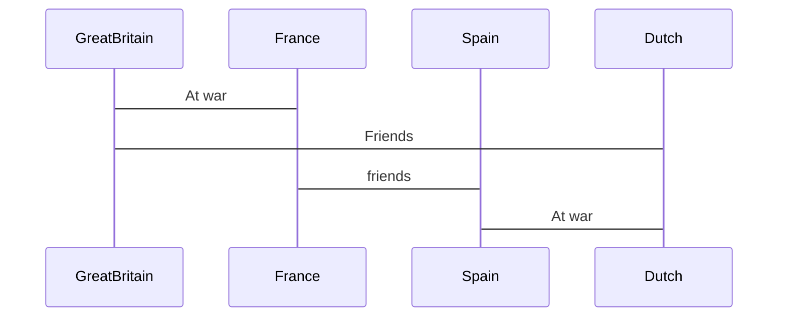

# Weigh Angor

Pirate webgame

## Ship
* [Types of Ships](#types-of-ships)
* [Weapon systems](#weapon-systems)
* [Ammunition types](#ammunition-types)
* [Ship Upgrades](#ship-upgrades)

### types of ships
| Tier | Name       | Size   | Masts | Speciality | Speed    | Control   | Cannons |
|------|-------------------|--------|-------|---------|----------|----------|---|
| 1    | Sloop              | S      | 1   | Multi  | Fast     | very Good| 2
| 2    | Schooner           | M      | 2   | Trade  | very fast| very Good| 2 
| 2    | Corvette           | M      | 2   | Warfare| Fast     | Good     | 4
| 3    | Frigate            | L      | 3   | Warfare| average  | average  | 6
| 3    | Carrack(Portugese?)| L      | 3   | Trade  | average  | average  | 4
| 4    | Ship of the line   | XL     | 3   | Warfare| Slow     | Bad      | 16
| 5    | IronClad           | XL     | X   | Warfare| average  | average  | 8
### weapon systems
| Tier | Name             | Type   | Reload | Damage| Accuracy| Range
|------|--------|---------|--------|-------|---------|------
| 1    | Culverin         | Cannon | AVERAGE| LOW   | AVERAGE | AVERAGE
| 2    | Demi-cannon      | Cannon | AVERAGE| AVERAGE| AVERAGE| AVERAGE
| 3    | Cannon           | Cannon | AVERAGE| HIGH  | AVERAGE| AVERAGE
| 2    | Mortar           | Mortar | HIGH   | HIGHvsBuild| LOW| HIGH
| 3    | Naval Mortar 	  | Mortar | HIGH   | HIGH  | LOW| VERY HIGH
| 2    | Carronade        | Cannon | AVERAGE| HIGH  | LOW| VERY LOW
| 3    | Firebarrel Mines | Mine   | HIGH   | HIGH  | N/A| N/A
### ammunition types
| Tier | Name         | Type      | EFFECT
|------|--------------|-----------|--------
| 1    | Round shot| CannonAMMO   | default
| 2    | Heated shot| CannonAMMO  | chance of fire
| 2    | Canister shot| CannonAMMO| higher crew damage lower range
| 2    | Bar shot| CannonAMMO     | sail damage, low range
| 2    | Chain shot| CannonAMMO   | slowes ships down, low range
| 3    | Explosive shot|CannonAMMO| higher damange and chance of fire
### ship upgrades

### Ship repair
| Part  | Repair material    |
|-------|--------------------|
| Sails | Cotton             |
| Hull  | Wooden planks      | 

#### Sails
| Tier | Name      | Speed
|------|----------------|-----------
| 1    | Scavenged | Default
| 2    | Improved  | better
| 3    | Royal     | best 
#### Hulls size
| Tier | Name           | Inventory Space 
|------|----------------|-----------
| 1    | Basic          | Default
| 2    | Trader         | better
| 3    | Merchant       | best 
#### Crew Quarters
| Tier | Name   | Crew Space 
|------|--------|-----------
| 1    | Basic  | Default
| 2    | Large  | better
| 3    | Navy   | best 
#### Armor
| Tier | Name          | Armour 
|------|---------------|-----------
| 1    | Wooden        | Default
| 2    | Reinforced    | better
| 3    | Copper Plated | best 
| 3    | Royal         | best
#### Ammunition Stock
| Tier | Name     | Ammo Inventory Space
|------|----------|-----------
| 1    | Basic    | Default
| 2    | Expanded | better

## Faction
### Factions
| color | Current Name | Property? | Bonus |
|---|-----|-----|-----|
| Red | Great Britain | Rule Britannia | 5% extra damage |
| Blue | France | Parisian Pride | 5% extra speed |
| Yellow | Spain | Imperia Hispania | 5% extra health |
| Orange | Dutch | VOC(United East india Company) Mentality | 5 extra inv slots |
| Black | Pirate | Lawless | 10% more crew |
### Relationship

## Crew properties 

### Weapons
| Tier |   Name         | Type
|------|----------------|-----------
| 1    | Dagger         | Melee
| 1    | Axe            | Melee
| 2    | Sword          | Melee
| 1    | Pistol         | Short Range
| 2    | Blunderbuss    | Short Range
| 1    | Flintlock Musket| Long Range
| 2    | Rifle Musket    | Long Range
| 3    | Rifle Bayonet   | Long Range

## Resources

### Resource list

|   Resource      | Usage
|-----------------|-----------
| Wood            | Raw Resource
| Cotton          | Raw Resource
| Wooden Planks   | Repair material
| Cloth           | Repair material
| Wheat           | Raw Resource
| Bread           | Food
| Iron ore        | Raw Resource
| Steel           | Repair material